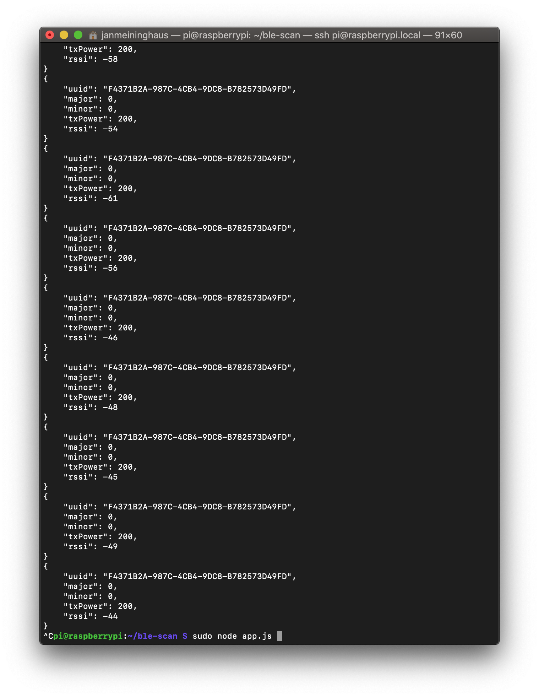

# Beacon Scanning POC

### Teil 1 von 5 für den PoC von You.

#### Voraussetzungen zum starten

* Beacon oder RasPi der als Beacon konfiguiriert wurde
* Raspi mit Bluez installiert

Komandos zum starten des Scanners:
```
npm i
node app.js
```

Ergebnis: 


