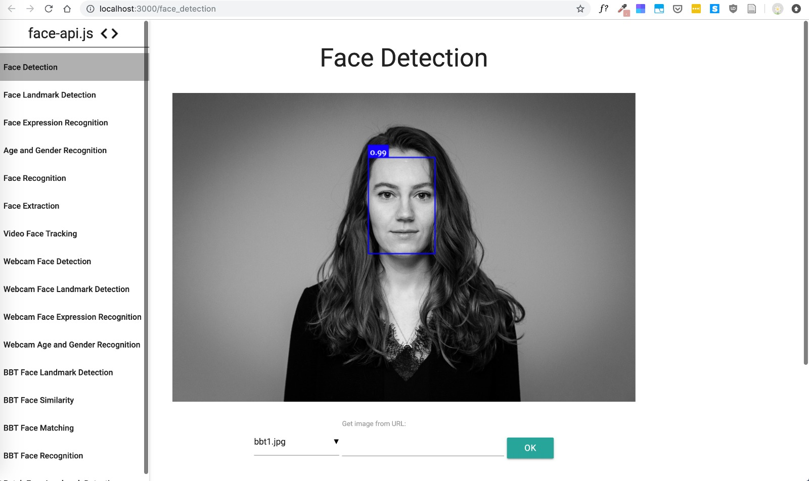

# Facial Detection POC

### Teil 3 von 5 für den PoC von You.

PoC ist in den Beispielen eingebaut und wurde angepasst. Zeigt auch die Fähigkeiten, die die Library kann
Komandos zum starten nach dem clonen:
```
cd examples/examples_browser
npm i
node server.js
```

Danach sollte es so aussehen: 

